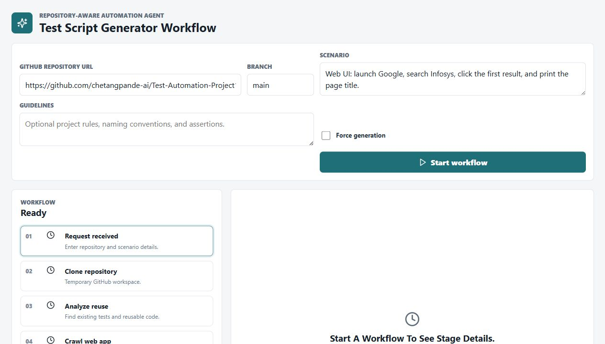
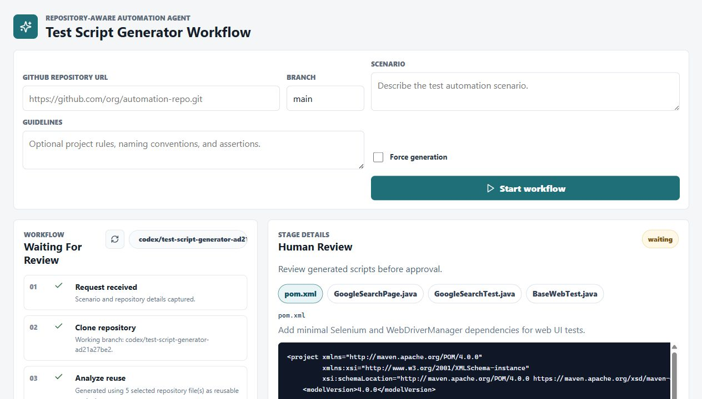
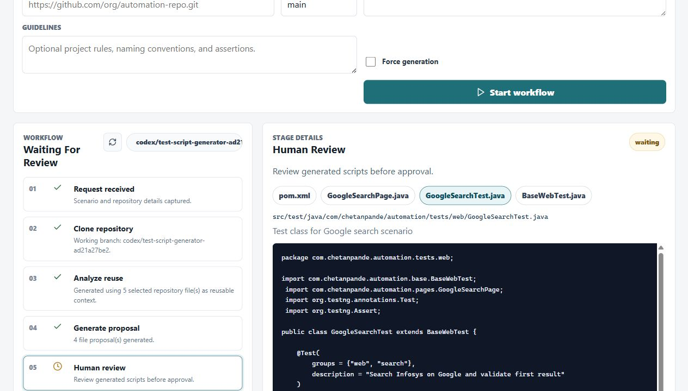

# AI-Powerd-TestscriptGenerator

Repository-aware test script generator agent.

The local project contains only the agent implementation:

- Python/LangGraph generator backend
- FastAPI workflow API
- React human-in-the-loop review UI
- deterministic repository scanner for code reuse analysis
- lightweight web crawl evidence for new UI automation

Generated automation projects are created in the target GitHub repository, reviewed in the UI, and committed through pull requests. Temporary local clones under `agent/workspaces` are ignored and cleaned after runs.

For web UI scenarios, the agent first checks for existing automation. If no matching script exists, it crawls the target URL from the scenario, guidelines, or repository config, builds a raw UI action plan, and asks the LLM to convert it into framework-style Selenium/TestNG Page Object Model code.

## UI Screenshots

Start a workflow by providing the GitHub repository, branch, scenario, and optional generation guidelines.



Review the workflow stages and inspect stage-specific details before any repository changes are made.



Generated files are shown as tabs so reviewers can inspect proposed framework, page object, and test changes before approval.



## Documentation

See [docs/README.md](docs/README.md) for:

- agent workflow
- how the system works
- code analysis approach
- example scenarios and expected outcomes

## Run

Start the backend:

```powershell
.\.venv\Scripts\uvicorn.exe test_script_generator.server:app --host 127.0.0.1 --port 8000
```

Start the UI:

```powershell
cd agent\ui
npm run dev
```

Open:

```text
http://127.0.0.1:5173
```
